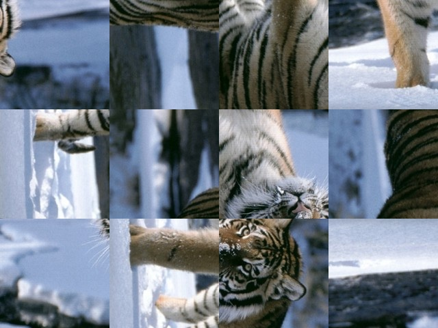
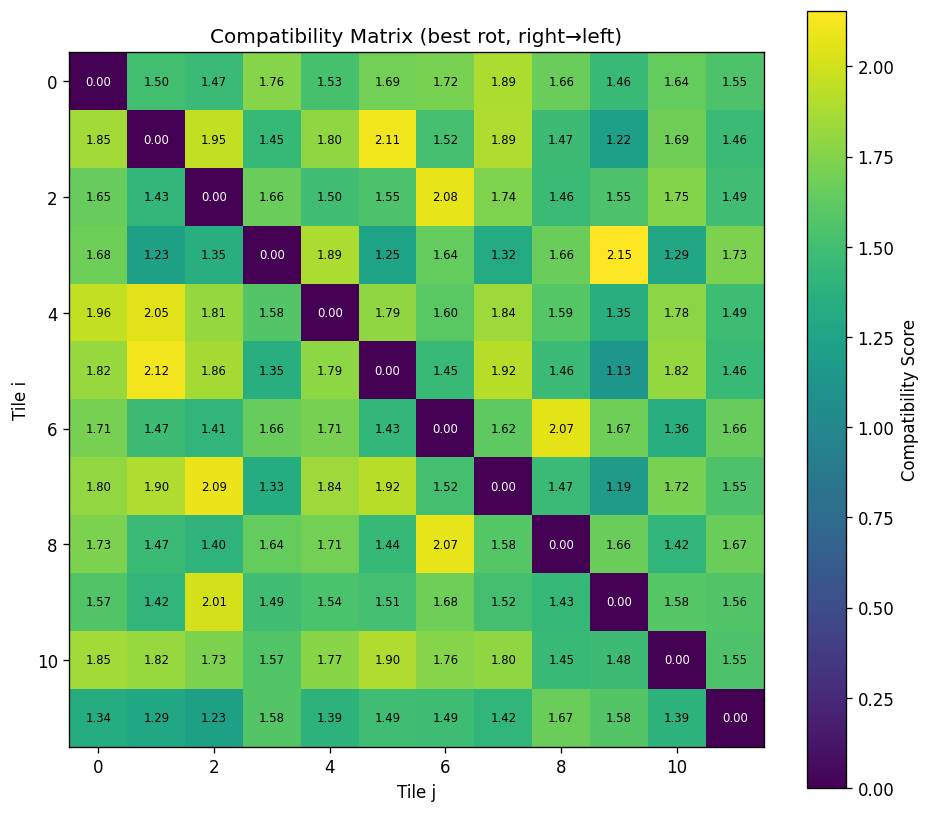
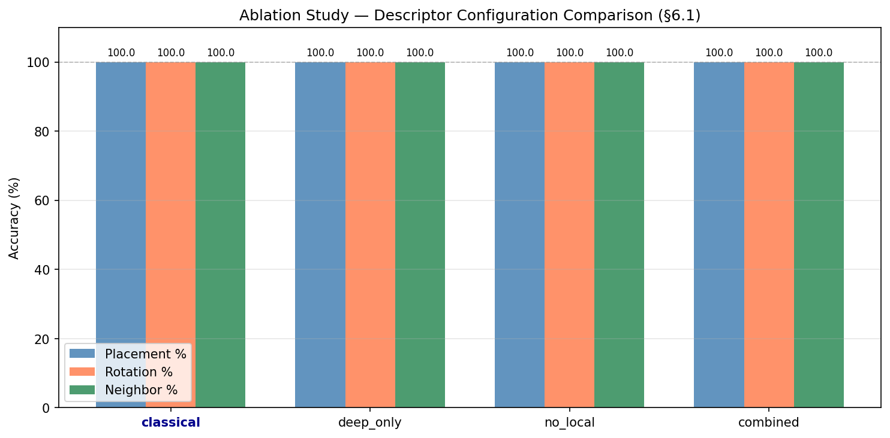

# Lost in Pieces — Image Jigsaw Reconstruction

Hybrid computer vision pipeline for reconstructing shuffled and rotated image puzzles.


## Table of Contents

- [English](#english)
  - [Overview](#overview)
  - [Method](#method)
  - [Main Results](#main-results)
  - [Installation](#installation)
  - [Usage](#usage)
  - [Output Structure](#output-structure)
  - [Visual Results](#visual-results)
  - [Documentation](#documentation)
- [Ελληνικά](#ελληνικά)
  - [Περιγραφή](#περιγραφή)
  - [Μεθοδολογία](#μεθοδολογία)
  - [Βασικά Αποτελέσματα](#βασικά-αποτελέσματα)
  - [Εγκατάσταση](#εγκατάσταση)
  - [Εκτέλεση](#εκτέλεση)
  - [Δομή Εξόδων](#δομή-εξόδων)
  - [Ενδεικτικά Αποτελέσματα](#ενδεικτικά-αποτελέσματα)
  - [Τεκμηρίωση](#τεκμηρίωση)

---

## English

### Overview

This project reconstructs an image from square tiles that are randomly shuffled and rotated.

### Method

The pipeline has four stages:

1. **Stage 1 — Shuffling:** image crop, grid creation, tiling, shuffling, rotation.
2. **Stage 2 — Features:** extraction of color, texture, local, edge, and deep descriptors.
3. **Stage 3 — Solving:** greedy multi-start search with local optimization.
4. **Stage 4 — Ablation (optional):** comparison of feature configurations.

### Main Results

- **6/7 images:** `100%` placement, `100%` rotation, `100%` neighbor accuracy.
- **`egg.jpg`:** `16.7%`, `0%`, `0%` (low seam-information case, discussed in the report).

### Installation

```bash
python3 -m venv .venv
source .venv/bin/activate
pip install -r requirements.txt
```

### Usage

```bash
# Solve one image
python main.py --image I2.jpg --seed 42

# Run full batch
python main.py --all --seed 42

# Run ablation for one image
python ablation.py --image egg.jpg --seed 42

# Launch GUI
python gui.py
```

### Output Structure

Current output structure example (`I2`):

```text
results/I2/
  stage1.pkl
  stage2.pkl
  Stage_1_Shuffling/
    original_cropped.jpg
    shuffled_puzzle.jpg
  Stage_2_Features/
    avg_tile_histogram.png
  Stage_3_Solving/
    solved_puzzle.jpg
    compatibility_matrix.png
    evaluation.txt
  Stage_4_Ablation/
    ablation_results.csv
    ablation_comparison.png
    classical/solved_classical.jpg
    deep_only/solved_deep_only.jpg
    no_local/solved_no_local.jpg
    combined/solved_combined.jpg
```

### Visual Results

**Shuffled puzzle (Stage 1)**



**Solved puzzle (Stage 3)**


**Compatibility matrix (Stage 3)**



**Ablation comparison (Stage 4, I2)**



**Ablation outputs per configuration (I2)**


### Documentation

Detailed methodology and experiments: `report/report.pdf`.

---

## Ελληνικά

### Περιγραφή

Το project ανασυνθέτει εικόνα από τετράγωνα κομμάτια που έχουν ανακατευτεί και περιστραφεί τυχαία.

### Μεθοδολογία

Η ροή έχει τέσσερα στάδια:

1. **Stage 1 — Shuffling:** crop εικόνας, δημιουργία grid, τεμαχισμός, ανακάτεμα, περιστροφή.
2. **Stage 2 — Features:** εξαγωγή χαρακτηριστικών χρώματος, υφής, τοπικών σημείων, ακμών και deep embeddings.
3. **Stage 3 — Solving:** greedy multi-start αναζήτηση και local search για βελτιστοποίηση.
4. **Stage 4 — Ablation (προαιρετικό):** σύγκριση διαφορετικών συνδυασμών χαρακτηριστικών.

### Βασικά Αποτελέσματα

- **6/7 εικόνες:** `100%` θέση, `100%` περιστροφή, `100%` γειτνίαση.
- **`egg.jpg`:** `16.7%`, `0%`, `0%` (περίπτωση χαμηλής διακριτικής πληροφορίας, όπως αναλύεται στην αναφορά).

### Εγκατάσταση

```bash
python3 -m venv .venv
source .venv/bin/activate
pip install -r requirements.txt
```

### Εκτέλεση

```bash
# Επίλυση μίας εικόνας
python main.py --image I2.jpg --seed 42

# Batch εκτέλεση
python main.py --all --seed 42

# Ablation για συγκεκριμένη εικόνα
python ablation.py --image egg.jpg --seed 42

# Εκκίνηση GUI
python gui.py
```

### Δομή Εξόδων

Παράδειγμα τρέχουσας δομής εξόδων (`I2`):

```text
results/I2/
  stage1.pkl
  stage2.pkl
  Stage_1_Shuffling/
    original_cropped.jpg
    shuffled_puzzle.jpg
  Stage_2_Features/
    avg_tile_histogram.png
  Stage_3_Solving/
    solved_puzzle.jpg
    compatibility_matrix.png
    evaluation.txt
  Stage_4_Ablation/
    ablation_results.csv
    ablation_comparison.png
    classical/solved_classical.jpg
    deep_only/solved_deep_only.jpg
    no_local/solved_no_local.jpg
    combined/solved_combined.jpg
```

### Ενδεικτικά Αποτελέσματα

**Ανακατεμένο παζλ (Stage 1)**


**Τελική ανασύνθεση (Stage 3)**


**Πίνακας συμβατότητας (Stage 3)**


**Σύγκριση ablation (Stage 4, I2)**


**Ablation αποτελέσματα ανά configuration (I2)**


### Τεκμηρίωση

Αναλυτική περιγραφή πειραμάτων και μεθοδολογίας: `report/report.pdf`.
